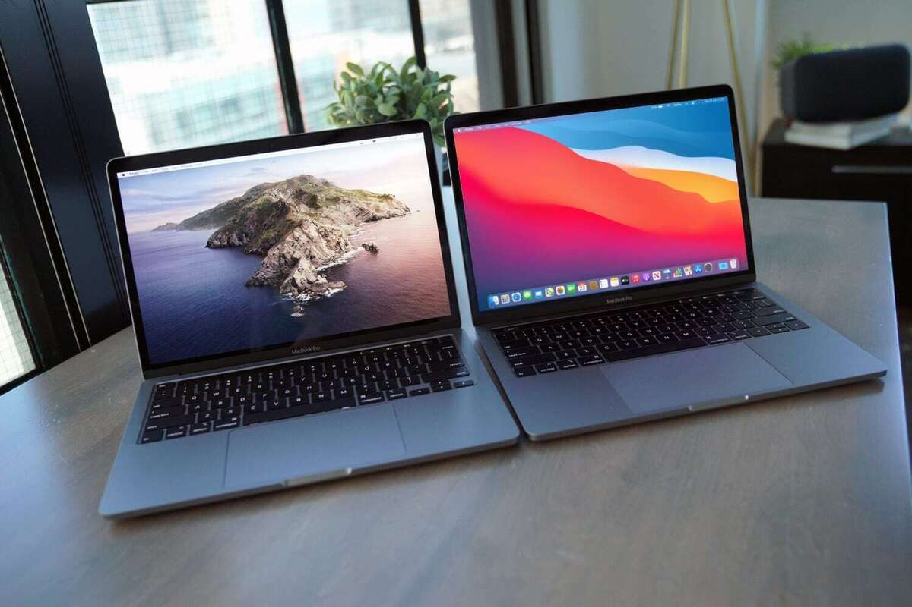

最近给手头的mbp更换了sn750作为启动盘，记录一下安装过程。



## 准备
* 备份：将当前启动盘的系统用TimeMachine备份起来
* 镜像：从AppStore搜索并下载BigSur
* U盘：一个经过格式化没有任何内容的U盘

> 为什么要从AppStore下载？

因为直接使用在线安装系统到新的启动盘视网络状况可能会花费好几个小时，然后因为网络波动断开前功尽弃。

## 制作U盘安装盘
下载好的镜像不要选择安装，而是直接退出。镜像AppImage被保存在`/Applications/Install\ macOS\ BigSur.app`。

假设U盘格式化后命名为`yuchanns`，那么硬盘的路径为`/Volumes/yuchanns`。

打开终端，执行下列命令，将系统安装工具注入到U盘：
```bash
sudo /Applications/Install\ macOS\ BigSur.app/Contents/Resources/createinstallmedia --volume /Volumes/yuchanns
```
等待终端执行完毕，会发现U盘名称被改写成`Install macOS BigSur`。

## 格式化新启动盘
重启mbp，在Apple Logo界面按住**command+R**直到出现进度条后松开，进入到**macOS实用工具**界面。

顶部栏选择`实用工具-启动安全性实用工具`，勾选`允许从外部介质或可移动介质启动`。

回到**macOS实用工具**界面，选择`磁盘工具`，然后右上角选择`显示所有设备`，选中新的启动盘，点击`抹掉`，格式选择`APFS`，方案选`GUID分区图`，进行格式化。

## 安装系统
重启mbp，在Apple Logo界面按住**option**直到进入到启动引导界面，选择名为**Install macOS BigSur**的U盘引导盘，进入到**macOS实用工具**界面。

选择`从外部介质安装BigSur`，按照提示选择安装到新启动盘中。

大概一二十分钟后安装完成，系统自动重启，进入到迁移助手，将备份恢复到新的启动盘，完成安装。