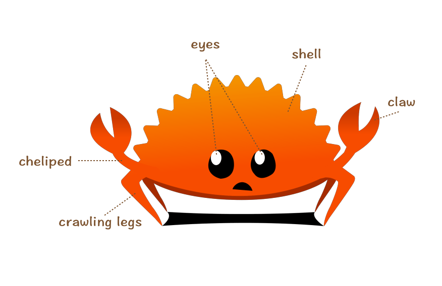

一文总结Rust语言精要，快速形成整体风格认知。

## 文章构成
* 环境安装与工具链
    * 环境安装
    * 编译器与包管理器
    * 核心库与标准库
* 语法介绍
    * 表达式
    * 变量声明与内存管理
    * 函数与闭包
    * 流程控制
* 数据类型
    * 基础类型
    * 复合类型
    * 标准库通用集合类型
    * 智能指针
* 泛型与接口抽象
    * 泛型
    * trait
* 错误处理
* 注释与打印