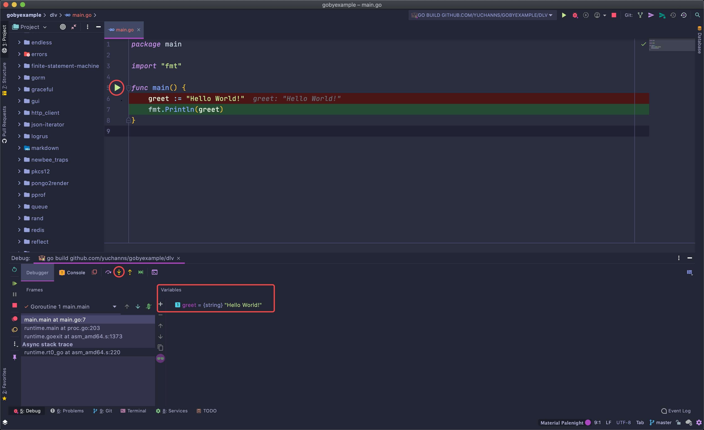

[delve](https://github.com/go-delve/delve)（以下简称dlv）是一个go语言debug工具。

如果读者有使用Goland进行debug的经验，应该很熟悉——当我们进行debug的时候，只需要在代码对应的地方打上断点，然后右键`main`或者`Test*`开头函数旁边的绿色三角箭头标记，选择debug，IDE就会自动执行到断点处并暂停程序的运行。接着我们在IDE下方弹出的Debug窗口里，点击黄色的箭头(`Step Info`)就可以进行**单步调试**；同时我们还可以在Vriables框里看到该函数中被分配的变量类型及其内容等信息。



这是JetBrains编辑器的福利之一，而一旦我们因为许可证问题（比如开源许可证不可用于商业开发）不能使用Goland，又该怎么进行debug呢？答案当然是开头提到的dlv。

## 快速开始
dlv的获取方式很简单，和平时拉取go第三方库的方式一样，执行`go get -u github.com/go-delve/delve/cmd/dlv`即可。

```bash
❯ tree
.
├── README.md
└── dlv
    └── main.go
```

打开你的终端，进入项目所在的根目录——本文以使用了go module管理的[yuchanns/gobyexample](https://github.com/yuchanns/gobyexample)为例，它的module名为`github.com/yuchanns/gobyexample`，项目结构如上——本例子试图对根目录下的dlv文件夹中的main.go文件进行debug；然后执行`dlv debug github.com/yuchanns/gobyexample/dlv`开启了debug会话框：

```bash
dlv debug github.com/yuchanns/gobyexample/dlv
Type 'help' for list of commands.
(dlv)
```

键入`funs main`，得到包含main字眼的函数的信息，其中，属于用户编写的入口main函数为`main.main`；接着输入`b main.main`对该函数进行断点标记，然后键入`c`直接运行到该断点处，可以看到会话输出了函数的内容：
```bash
(dlv) funcs main
main.main
runtime.main
runtime.main.func1
runtime.main.func2
(dlv) b main.main
Breakpoint 1 set at 0x10c2393 for main.main() ./dlv/main.go:5
(dlv) c
> main.main() ./dlv/main.go:5 (hits goroutine(1):1 total:1) (PC: 0x10c2393)
     1:	package main
     2:
     3:	import "fmt"
     4:
=>   5:	func main() {
     6:		greet := "Hello World!"
     7:		fmt.Println(greet)
     8:	}
(dlv)
```
键入`s`进行单步调试，连续两次，再键入`locals`查看分配的局部变量信息：
```bash
(dlv) s
> main.main() ./dlv/main.go:7 (PC: 0x10c23b6)
     2:
     3:	import "fmt"
     4:
     5:	func main() {
     6:		greet := "Hello World!"
=>   7:		fmt.Println(greet)
     8:	}
(dlv) locals
greet = "Hello World!"
(dlv)
```
体验和使用Goland自带的debug功能类似！当然，现在读者对上述的操作指令一无所知，不免感到迷惑。接下来笔者将结合help命令对常用的指令进行解释说明。